# Cybersecurity: Splunk SIEM Apache Log Analysis & Dashboarding

## Table of Contents
- [Introduction to Splunk Enterprise (SIEM)](#-introduction-to-splunk-enterprise-siem)
- [Project Overview](#-project-overview)
- [Objective](#-objective)
- [System Specifications](#️-system-specifications)
- [Phase 1: Dashboard Initialization](#phase-1-dashboard-initialization)
- [Phase 2: Data Ingestion](#phase-2-data-ingestion)
- [Phase 3: Core SPL Queries & Metric Panels](#phase-3-core-spl-queries--metric-panels)
- [Phase 4: Advanced Visualizations & Geographic Mapping](#phase-4-advanced-visualizations--geographic-mapping)
- [Final Report Generation](#-final-report-generation)

---

## Introduction to Splunk Enterprise (SIEM)
**Splunk Enterprise** is an industry-leading platform utilized by Security Operations Centers (SOCs) for searching, analyzing, and visualizing machine-generated data in real-time. In the cybersecurity domain, it functions as a powerful Security Information and Event Management (SIEM) tool. Splunk ingests massive volumes of logs from networks, servers, and applications, allowing security analysts to detect anomalies, investigate breaches, and monitor the overall health and security posture of an IT infrastructure.

## Project Overview
This project documents the operational log analysis and visualization phase within a locally hosted Splunk Enterprise instance. It details the workflow of ingesting JSON-formatted Apache web server logs, configuring interactive input controls, and constructing advanced Search Processing Language (SPL) queries. The culmination of this lab is a fully dynamic executive dashboard designed to monitor web traffic, HTTP status codes, and the geographic origin of incoming requests.

## Objective
To successfully ingest raw web server logs into a functional SIEM environment and translate that data into actionable security intelligence. By crafting precise SPL queries and mapping them to visual panels, this project establishes a baseline SOC dashboard for real-time traffic monitoring and threat hunting.

## System Specifications
*   **Operating System Environment:** Windows / Windows Server Architecture
*   **Software Version:** Splunk Enterprise 10.4.2 (64-bit)
*   **Ingestion Source:** Local JSON Log File (`apache_logs.json`)
*   **Web Interface Access:** `localhost:8000`

---

## Phase 1: Dashboard Initialization

To begin, a centralized location for visualizing the log data was required. I navigated to the "Search & Reporting" app and initialized a new dashboard workspace.
 

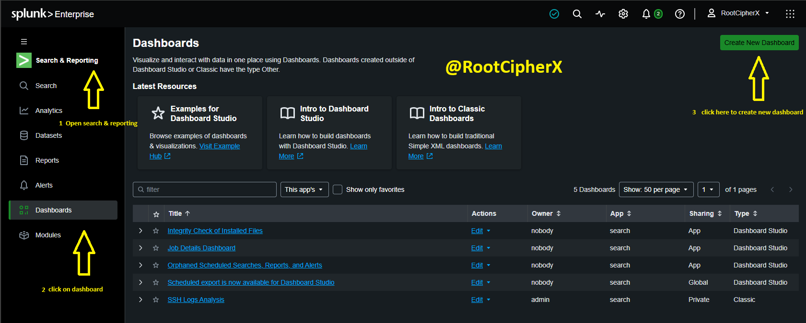

Configured the dashboard metadata, naming it "Splunk Dashboard for Web Traffic Logs" and setting its permissions to Private for the initial build phase.
 

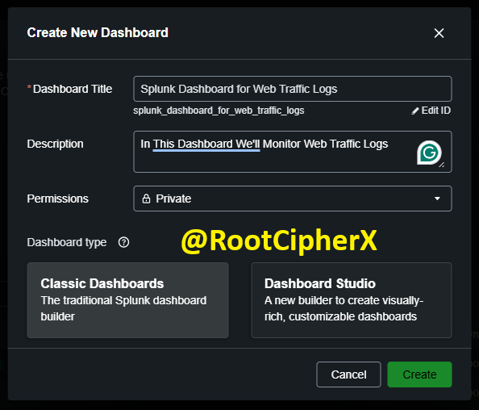

The blank dashboard was successfully provisioned and ready for customization.
 

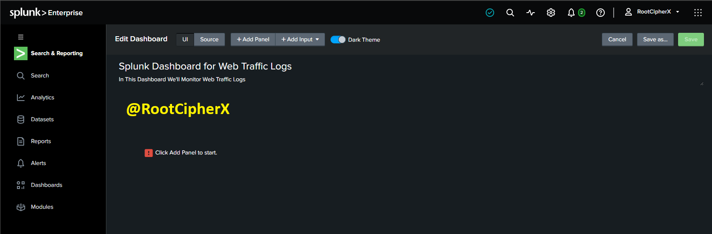

To allow dynamic filtering of log data, an interactive input panel was necessary. I accessed the "Add Input" menu to integrate user controls.
 

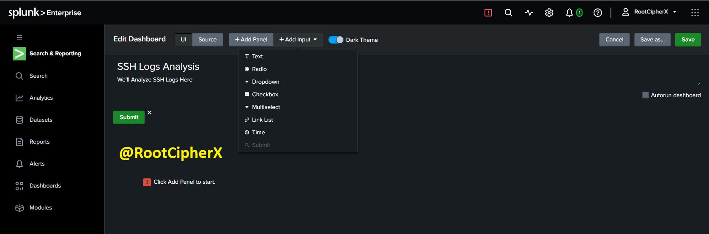

Selected the "Time" input module, which allows analysts to filter dashboard metrics based on specific chronological windows.
 

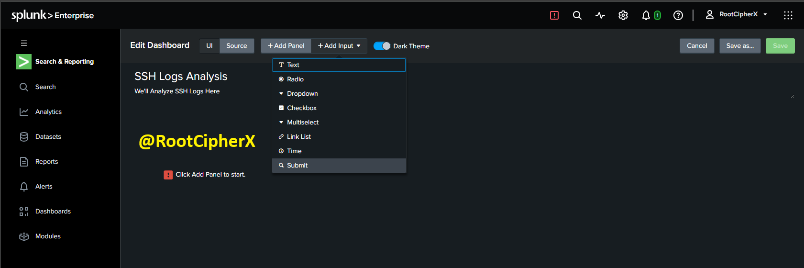

Configured the Time Picker properties, binding it to the underlying search queries and defaulting the view to analyze "All time".
 

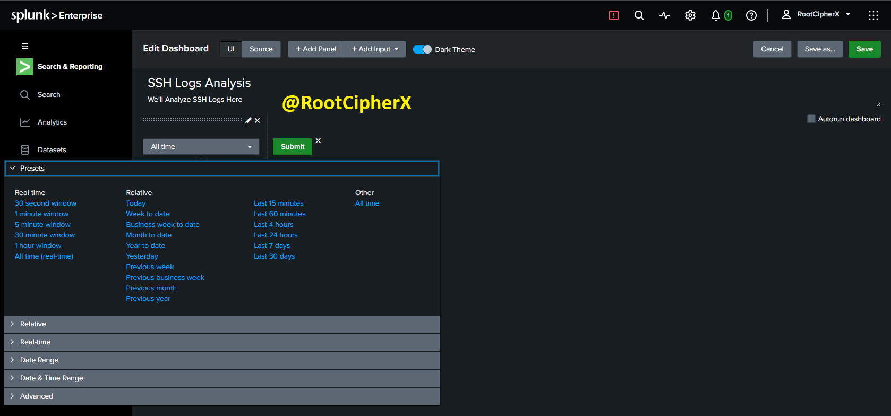

Finalized the time input panel by assigning it the standard `time_range` token.
 

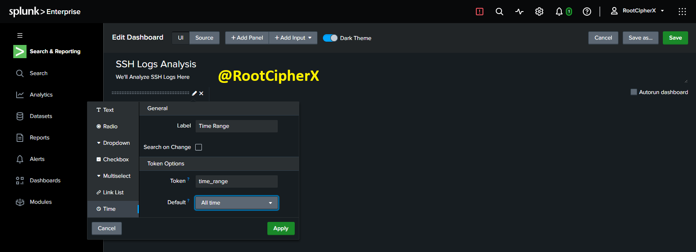

---

## Phase 2: Data Ingestion

With the dashboard foundation laid, the target Apache logs needed to be ingested into the Splunk indexer. Accessed the global "Settings" menu and initiated the "Add Data" sequence.
 

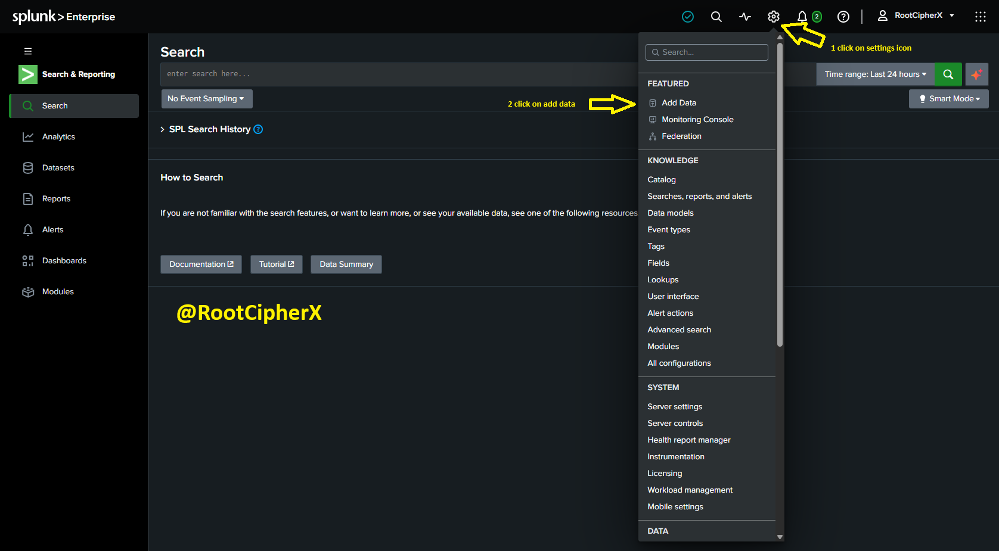

Selected the "Upload" method to ingest the local log files directly from the host system into the Splunk platform.
 

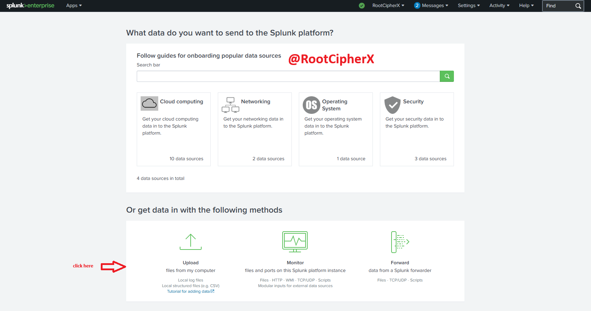

Browsed the local storage and successfully uploaded the target `apache_logs.json` file.
 

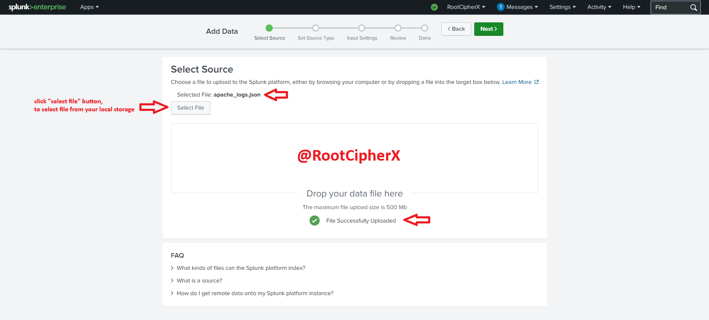

Progressed through the "Set Source Type" phase, confirming that Splunk correctly parsed the incoming data as `_json` formatted events.
 

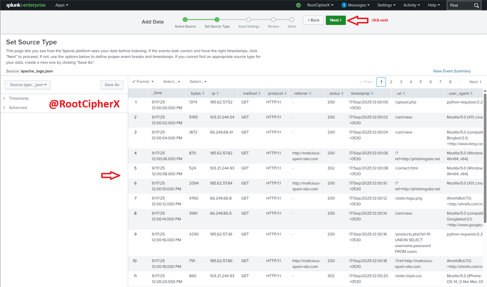

Modified the Input Settings, explicitly setting the "Host field value" to `Datta-Guru` to ensure all ingested events were properly attributed to the correct simulated web server.
 

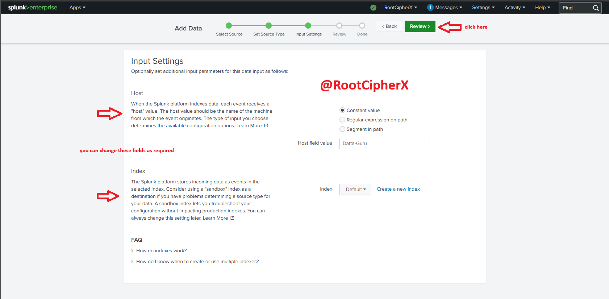

Reviewed the final data ingestion parameters before committing the data to the default Splunk index.
 

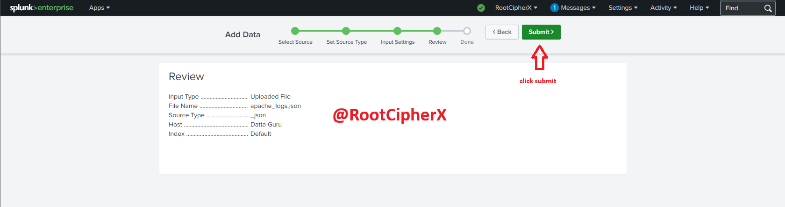

The JSON log file was successfully indexed. Clicked "Start Searching" to begin the data analysis phase.
 

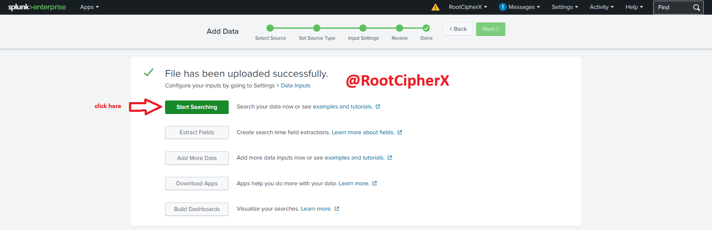

The main Splunk search interface successfully populated with the raw, parsed Apache log events.
 

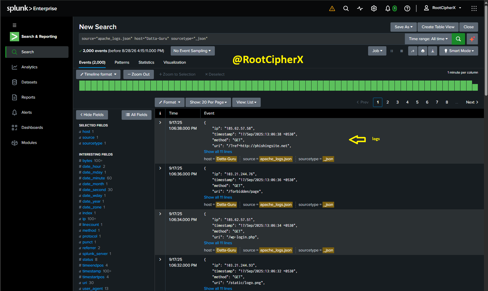

---

## Phase 3: Core SPL Queries & Metric Panels

To visualize the data, custom Search Processing Language (SPL) queries were constructed. Each query leverages the pipe `|` operator to pass the base search results into a statistical command.

**Query 1: Total Web Requests**
*   **SPL:** `source="apache_logs.json" host="Datta-Guru" sourcetype="_json" | stats count AS "Total Web Requests"`
*   **Breakdown:** The base search defines the exact file, host, and formatting. The pipe `|` sends those events into `stats count`, which aggregates the absolute number of events and aliases the column for readability.
 

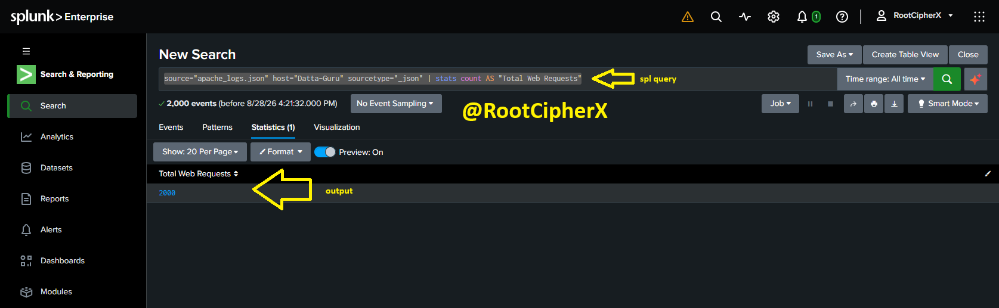

Selected "Add Panel" and converted the raw statistical output into a "Single Value" visualization for the dashboard.
 

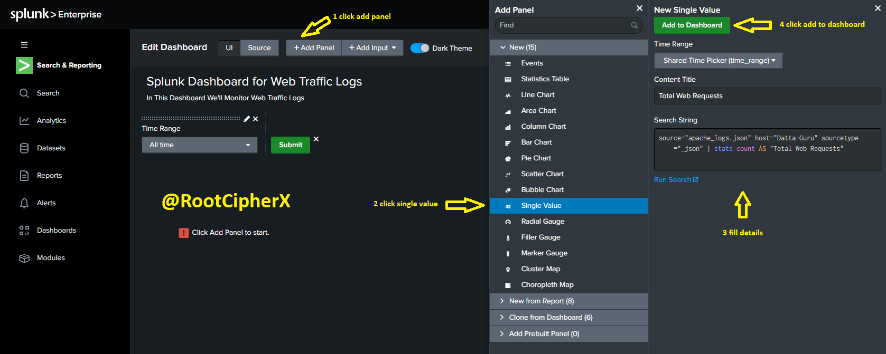

The dashboard successfully displayed the total volume of processed web requests (2,000 events).
 

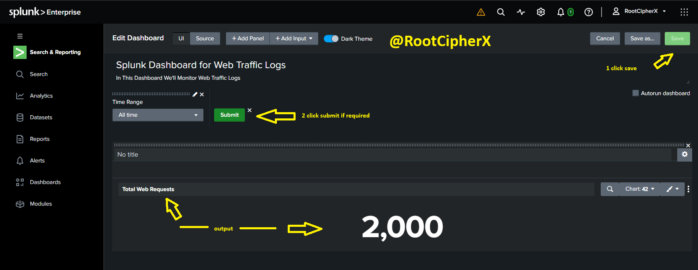

**Query 2: Successful HTTP Responses**
*   **SPL:** `source="apache_logs.json" host="Datta-Guru" sourcetype="_json" method=GET status=200 | stats count AS "Successful Responses"`
*   **Breakdown:** Appends boolean `AND` logic (`method=GET status=200`) to the base search to explicitly filter for standard, successful connections before counting them.
 

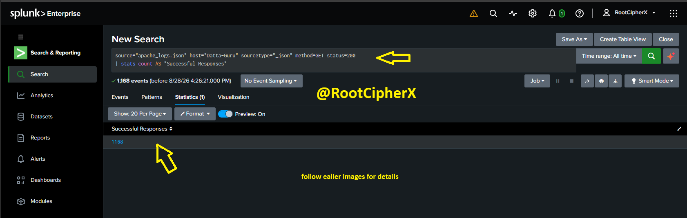

Added the refined query to the dashboard as a Single Value panel, displaying 1,168 successful connections. 
 

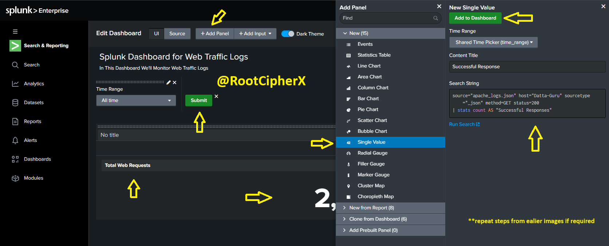

*To populate the remainder of the dashboard's top row, the following variations were executed:*
*   **Client Errors (HTTP 4xx):** `... status>=400 status<500 | stats count AS "Client Errors"` (Yielding 376 events).
*   **Server Errors (HTTP 5xx):** `... status>=500 | stats count AS "Server Errors (5xx)"` (Yielding 376 events).

---

## Phase 4: Advanced Visualizations & Geographic Mapping

To understand the origin and targets of the traffic, advanced aggregation and visualization modules were implemented.

**Query 3: Top Requested URIs**
*   **SPL:** `source="apache_logs.json" host="Datta-Guru" sourcetype="_json" | stats count by uri`
*   **Breakdown:** Rather than a single absolute count, this query aggregates the event frequency grouped by the `uri` field, identifying which web directories were targeted most frequently. 

**Query 4: Top Users by IP Address**
*   **SPL:** `source="apache_logs.json" host="Datta-Guru" sourcetype="_json" | stats count AS IP by ip`
*   **Breakdown:** Similar to the URI query, this counts the frequency of events but groups them by the originating `ip` address to identify the most active clients interacting with the server.
 

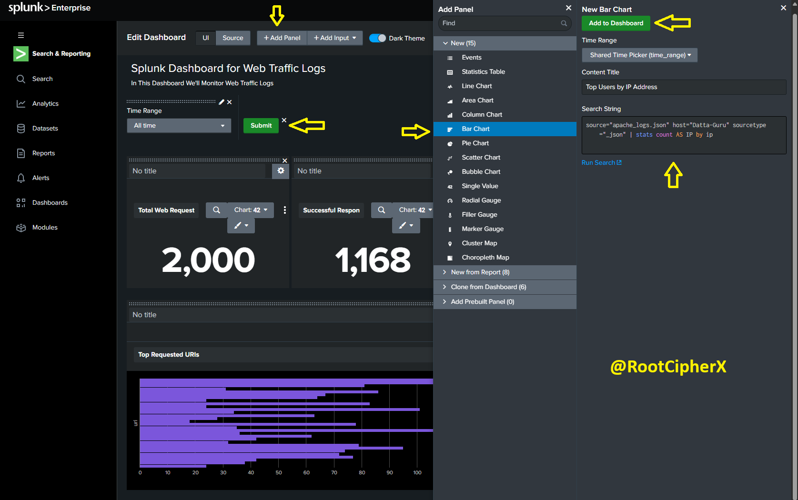

The rendered Bar Charts highlight the distribution of request volumes across URIs and client IP addresses.
 

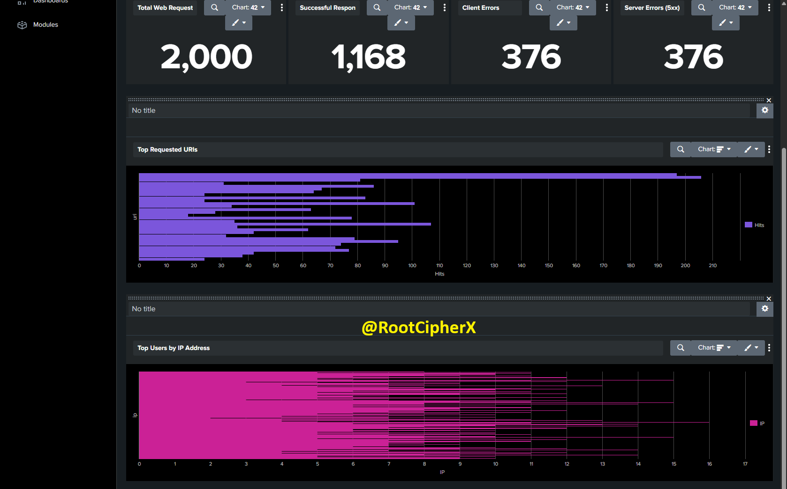

**Query 5: Geographic IP Mapping**
*   **SPL:** `source="apache_logs.json" ... method=GET | table ip | iplocation ip | stats count by Country | geom geo_countries featureIdField="Country"`
*   **Breakdown:** 
    *   `table ip`: Isolates only the IP address column.
    *   `iplocation ip`: Invokes Splunk's proprietary MMDB to append City, Country, Region, and Latitude/Longitude data.
    *   `stats count by Country`: Aggregates the total traffic volume per nation.
    *   `geom geo_countries`: Projects the aggregated statistics onto standard geometric polygons for the final map.
 

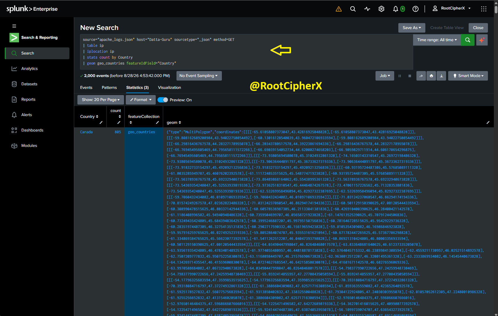

Selected the "Choropleth Map" module to render the geographic data accurately based on the `geom` output.
 

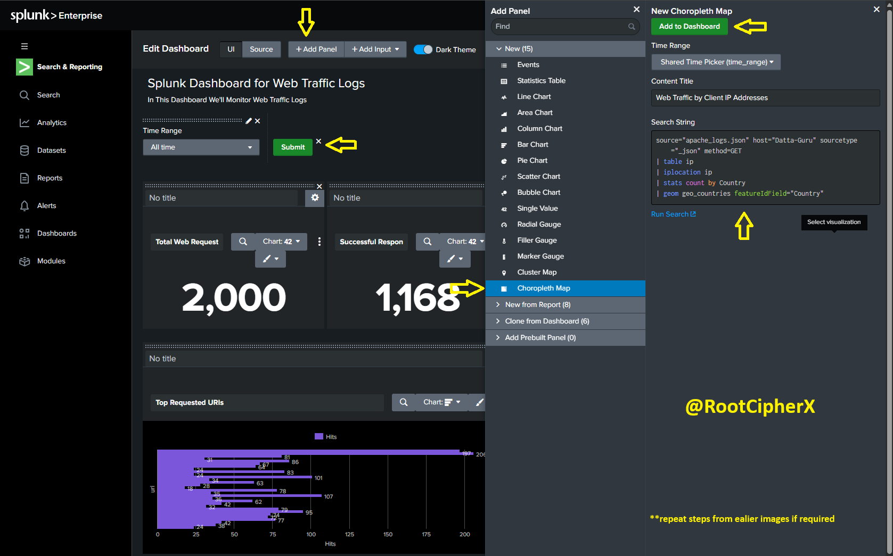

The rendered map provides immediate visual intelligence regarding the global origin of the inbound web traffic.
 

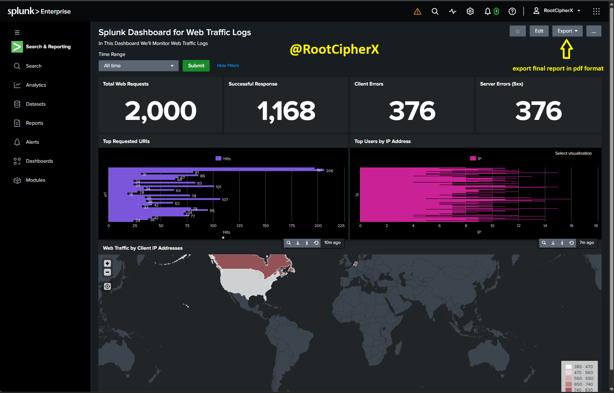

---

## Final Report Generation

With all metrics and visualizations successfully configured, the dashboard was organized, stylized in Dark Theme, and saved. The interface provides real-time oversight of critical web infrastructure health.
 

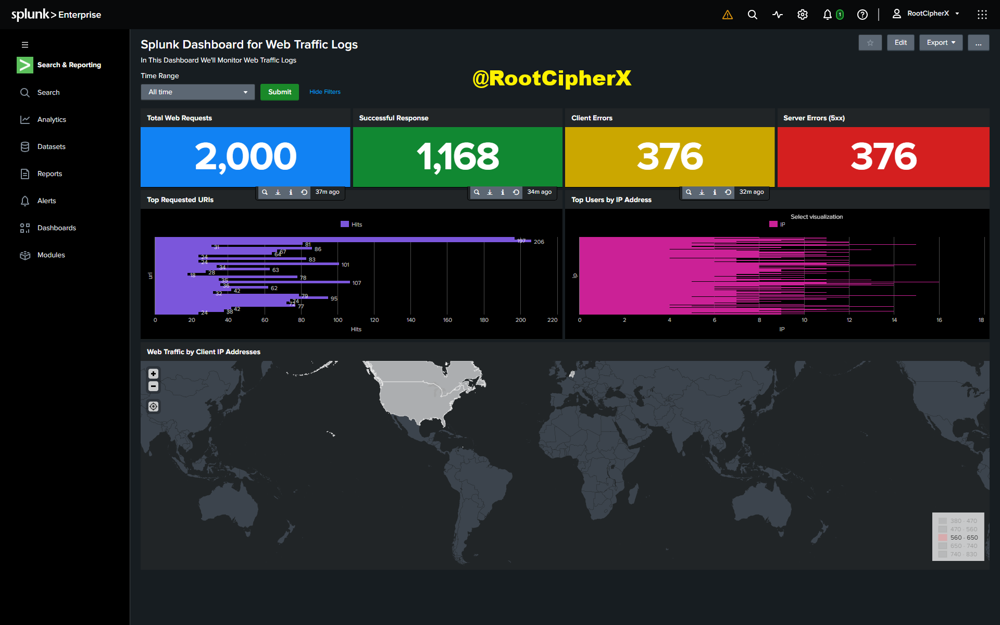

To provide an executive summary of the findings, the dashboard was exported as a static PDF report. The exported report confirms exactly 2,000 total web requests, 1,168 successful responses, 376 client errors, and 376 server errors[cite: 1]. The dashboard visualizations successfully tracked Top Requested URIs, Top Users by IP Address, and Web Traffic by Client IP Addresses.

---

## Executive Summary & Artifacts

With all metrics and visualizations successfully configured, the dashboard was organized, stylized in Dark Theme, and saved. The interface provides real-time oversight of critical web infrastructure health. To provide an executive summary of the findings for stakeholders, the dashboard was exported as a static PDF report. 

The finalized report confirms exactly 2,000 total web requests, 1,168 successful responses, 376 client errors, and 376 server errors[cite: 1]. The visualizations successfully track Top Requested URIs, Top Users by IP Address, and geographic Web Traffic by Client IP Addresses.

*   **View the full exported report here:** [Dhananjay_splunk_dashboard_for_web_traffic.pdf](docs/Dhananjay_splunk_dashboard_for_web_traffic.pdf) 

---

## Conclusion & Security Impact

Establishing a highly tuned SIEM dashboard is a foundational capability for Blue Team operations and SOC analysts. A properly configured Splunk environment allows security teams to:
*   **Centralize Log Management:** Aggregate disparate web server logs into a single, rapidly searchable repository.
*   **Proactive Threat Hunting:** Query massive datasets to identify Indicators of Compromise (IoCs), such as high-frequency HTTP 4xx errors indicating directory brute-forcing, or abnormal geographic traffic spikes.
*   **Accelerated Incident Response:** Reduce the Mean Time to Detect (MTTD) and Mean Time to Respond (MTTR) by translating raw text logs into immediate visual intelligence.

---

## Ethical Guidelines & Disclaimer

This log analysis and SIEM configuration lab was performed within a private, authorized environment strictly for educational and defensive cybersecurity training purposes. The data utilized consists of simulated web traffic logs designed specifically for learning SPL syntax, data ingestion, and dashboard construction.
